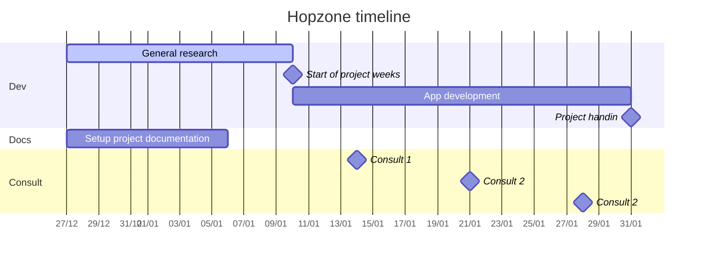

# Hopzone - A full-stack 2D Multiplayer game made in P5.js

## :memo: Project description

### Game
Hopzone is a 2D multiplayer platformer game. It is a browsergame where players can create their own levels with premade assets. The goal of the game is to successfully jump platforms and get to the top platform! 

### Project
This project is a student research project of the bachelor **[Multimedia & Creative Technologies](https://mct.be/)**. As part of this module we were given the assignment to research a topic that hasn't been covered in the learning program. The application will be a full-stack web application.

## :question: Research Question
At the start of this project we had to choose a topic we wanted to research and formulate a research question about this topic.

:::info
**What are the possibilities of a multiplayer 2D game based on Processing(P5.js)?**
:::

### Sub-Questions

To research this topic, the main research question has to be divided into multiple sub-questions. These questions will guide me to find an answer to the main research question.

- Which backend framework is the most suitable for this application?
- In what ways can 2D level data be stored? Which way is the best for this application?
- How do you keep track of the state of an active game session?
- What ways are there to realise realtime multiplayer?
- What is a good workflow in P5?

## :heavy_check_mark: Requirements

These are the requirements to conclude I have delivered a **successful** project. 

---
The finished project has to be a working multiplayer browsergame. A platformer game where a player has to jump on platforms to get to the top of the level, while also dodging obstacles and monsters.

### Guest users
- Play levels of other players
- Play with multiple players

### Logged in user
- Create your own level
- Play levels of other users
- Play together with multiple users
- See his high scores

### Nice to have
- Creating your own level

## :hourglass: Project timeline

## :checkered_flag: Milestones

### 31/12
- [ ] Visual representation in contract plan
- [ ] Setting up git repos
- [ ] Research on backend framework
- [ ] Research on level data storage
### 07/01
- [ ] Choosing a frontend framework
- [ ] Choosing a backend framework
### 14/01
### 21/01
### 28/01
### 31/01
- [ ] 🥳 Project handin

